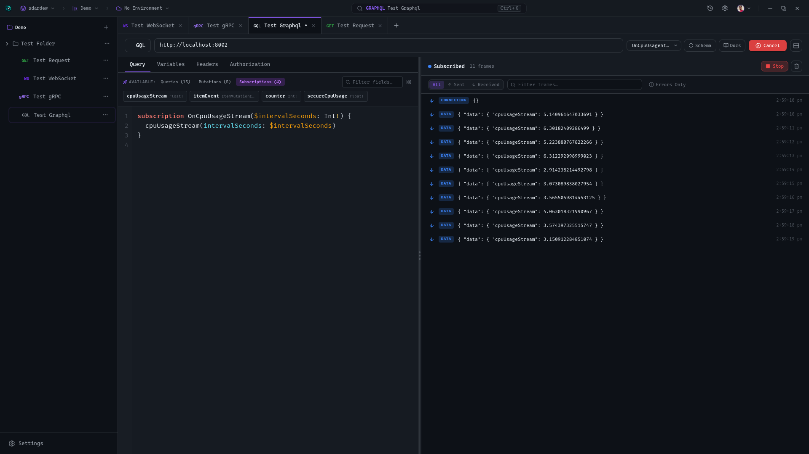

# 🐙 GitHub Dark — Veyak Theme

[](./theme.json)
[](./theme.json)
[](https://veyak.iamdhakrey.dev/schemas/themes/1.0.0.json)
[](./theme.json)
[](https://github.com/iamdhakrey/veyak-themes)

Official GitHub Dark palette for **[Veyak](https://github.com/iamdhakrey/veyak)** — the modern, extensible API client for REST, GraphQL, WebSocket, and gRPC.

Designed to deliver the authentic, sleek GitHub dark mode aesthetic with carefully tuned contrasts, official Primer-inspired color accents, and full syntax highlighting for request bodies, responses, and method badges.

---

## 📸 Preview



---

## ✨ Features

- **GitHub Palette**: Faithful implementation of GitHub's dark canvas (`#0D1117`), elevated surfaces (`#161B22`, `#21262D`), and crisp border hierarchy (`#30363D`).
- **Complete Method Badge Styling**: Custom brand-accurate colors for HTTP methods (`GET`, `POST`, `PUT`, `PATCH`, `DELETE`) as well as `WebSocket`, `GraphQL`, and `gRPC`.
- **High-Contrast Syntax Highlighting**: Pristine readability for JSON, XML, GraphQL, headers, and code snippets matching GitHub's code editor syntax.
- **Easy on the Eyes**: Tuned for long development, debugging, and testing sessions without eye fatigue.

---

## 🎨 Palette & Design Tokens

### UI Colors

| Token | Preview | Hex Code | Purpose |
| :--- | :---: | :---: | :--- |
| `colorBg` | `●` | `#0D1117` | Canvas background |
| `colorPanel` | `●` | `#161B22` | Sidebars, panels, tabs |
| `colorPanelRaised` | `●` | `#21262D` | Dropdowns, dialogs, popovers |
| `colorBorder` | `●` | `#30363D` | Default dividing borders |
| `colorBorderMuted` | `●` | `#21262D` | Subtle borders, dividers |
| `colorTextPrimary` | `●` | `#C9D1D9` | Headings, primary content |
| `colorTextSecondary` | `●` | `#8B949E` | Labels, descriptions |
| `colorTextMuted` | `●` | `#484F58` | Placeholders, disabled text |
| `colorPrimary` | `●` | `#1F6FEB` | Primary buttons, active state |
| `colorPrimaryHover` | `●` | `#388BFD` | Button & link hover state |
| `colorSecondary` | `●` | `#238636` | Secondary actions / confirmations |
| `colorSuccess` | `●` | `#238636` | Status 2xx, success badges |
| `colorWarning` | `●` | `#D29922` | Status 3xx, warnings |
| `colorError` | `●` | `#F85149` | Status 4xx/5xx, errors |

### API Method & Protocol Badges

| Method / Protocol | Token | Preview | Hex Code |
| :--- | :--- | :---: | :---: |
| **GET** | `methodGet` | `●` | `#2EA043` |
| **POST** | `methodPost` | `●` | `#1F6FEB` |
| **PUT** | `methodPut` | `●` | `#D29922` |
| **PATCH** | `methodPatch` | `●` | `#A371F7` |
| **DELETE** | `methodDelete` | `●` | `#F85149` |
| **WebSocket** | `methodWs` | `●` | `#A371F7` |
| **Query** | `methodQuery` | `●` | `#58A6FF` |
| **gRPC** | `methodGrpc` | `●` | `#38BDF8` |
| **GraphQL** | `methodGraphql` | `●` | `#DB61A2` |

### Syntax Highlighting Tokens

| Syntax Element | Token | Preview | Hex Code |
| :--- | :--- | :---: | :---: |
| Keywords, Booleans, Null | `keyword`, `boolean`, `null` | `●` | `#FF7B72` |
| Strings | `string` | `●` | `#A5D6FF` |
| Comments | `comment` | `●` | `#8B949E` |
| Properties, Operators, Numbers | `property`, `operator`, `number` | `●` | `#79C0FF` |
| Functions | `function` | `●` | `#D2A8FF` |
| Variables, Class Names | `variable`, `className` | `●` | `#FFA657` |
| Punctuation | `punctuation` | `●` | `#C9D1D9` |

---

## 📦 Installation

### Method 1: Through Veyak Themes Registry (Recommended)

1. Open **Veyak**.
2. Navigate to **Settings** (`⚙️`) → **Themes**.
3. Search for **GitHub Dark** in the Theme Store / Registry.
4. Click **Install** and **Activate**.

### Method 2: Manual Installation

1. Clone or download this repository:
   ```bash
   git clone https://github.com/iamdhakrey/veyak-github-dark-theme.git
   ```
2. Copy [`theme.json`](./theme.json) into your local Veyak themes directory:
   - **macOS / Linux**: `~/.config/veyak/themes/github-dark/theme.json`
   - **Windows**: `%APPDATA%\veyak\themes\github-dark\theme.json`
   *(or use the **Import Theme** option in Veyak's Theme Settings)*
3. Select **GitHub Dark** in your theme preferences.

---

## 🛠 File Structure

```
veyak-github-dark-theme/
├── theme.json         # Veyak theme definition manifest & tokens
├── screenshot.png     # Full-resolution preview screenshot
└── README.md          # Documentation & token reference
```

---

## 🤝 Contributing

Suggestions and improvements are welcome! If you notice any contrast issues or token mismatches:

1. Fork this repository.
2. Create your feature branch (`git checkout -b fix/color-contrast`).
3. Commit your changes (`git commit -m 'Improve contrast on secondary text'`).
4. Push to the branch (`git push origin fix/color-contrast`).
5. Open a Pull Request.

---

## 📄 License

This project is licensed under the [MIT License](./theme.json).

Inspired by GitHub's official Dark color system. Created for the [Veyak](https://github.com/iamdhakrey/veyak) community by [@iamdhakrey](https://github.com/iamdhakrey).